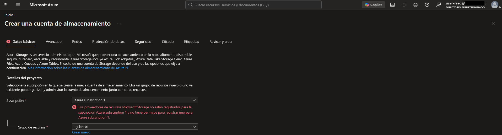
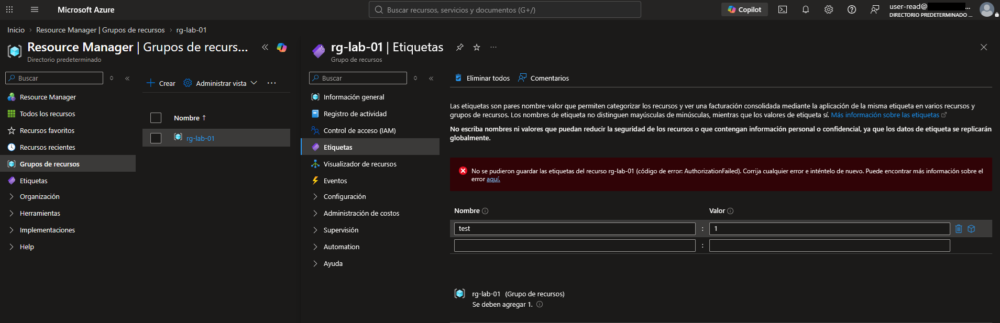

# Lab Log

## Objective
Create a security lab on Azure to practise Cloud Security engineering, with focus on IAM . The environment is deployed with deliberate misconfigurations to then detect them with open-source and native tools, remediate them as code (Terraform) and add controls to prevent regressions.

## Environment
- Platform: Azure (free account)
- Region: Spain
- Naming convention: 'rg-lab-01', 'grp-lab-read', 'user-read', 'admin-lab'

## Decisions
- Separate lab admin account ('admin-lab') from personal account
- Security Defaults + MFA enabled
- Budget alert from day 1
- Roles assigned to a group, not to individual users
- Reader role scoped to 'rg-lab-01' only

## Evidence 1 - Least privilege works
**What I tested:** whether a user with only the Reader role in 'rg-lab-01' can modify resources.

**Setup:** 'user-read' is a member of 'grp-lab-read', which has the Reader role scoped to 'rg-lab-01'.

**Expected result:** read-only access; any write action should be denied.

**Actual result:** 'user-read' can see the resource group but cannot create a storage account or change tags.

**Conclusion:** role assignment to a group at resource group scope enforces least privilege as intended.

## Next steps
- [ ] Install Azure CLI and Terraform
- [ ] Recreate the manual setup as code
- [ ] Deploy base environment
